<p align="center" style="font-size: 24px; font-weight: bold;">LAPORAN AKSI IMPLEMENTASI</p>
<p align="center" style="font-size: 24px; font-weight: bold;">PELATIHAN AAWS, AWS & ARG</p>

---

## 1. Informasi Umum

- **Nama Peserta**: Satria Mitra Utama
- **Instansi / UPT BMKG**: Stasiun Klimatologi Riau
- **Nama Pelatihan**: Pelatihan Peralatan AWS dan ARG
- **Topik Aksi Implementasi**: Pengembangan Dashboard Monitoring ALOPTAMA berbasis teknologi terbuka (open-source software) dengan DoMPoNG (Docker, MQTT, PostgreSQL, Node-RED, Grafana) stack
- **Tanggal Implementasi**: 23 Juni 2025

## 2. Latar Belakang Singkat

<p align="justify">Stasiun Klimatologi Riau memiliki tugas dalam melakukan pengamatan, pengolahan, analisis, dan penyebarluasan data iklim serta informasi klimatologi secara berkelanjutan. Dalam menunjang pelaksanaan tugas tersebut, diperlukan sistem monitoring yang efisien, real-time, dan mudah diakses untuk memantau kondisi peralatan observasi otomatis seperti ALOPTAMA (AAWS, AWS, dan ARG).
</p>

<p align="justify">Pengembangan dashboard untuk memantau kondisi peralatan ALOPTAMA dapat membantu tugas UPT dalam meningkatkan kualitas dan efektivitas pemantauan data observasi klimatologi secara visual, integratif, dan real-time. Hal ini juga merupakan bentuk dukungan terhadap amanat Undang-Undang Nomor 31 Tahun 2009 tentang Meteorologi, Klimatologi, dan Geofisika, khususnya:</p>

- Pasal 5 ayat (1): BMKG menyelenggarakan pengamatan, pengolahan, analisis, dan penyebarluasan informasi MKG.

- Pasal 7 ayat (2): Dalam pelaksanaan tugasnya, BMKG bertanggung jawab menyediakan informasi MKG secara cepat, tepat, akurat, dan mudah dipahami.

- Pasal 15: Pengamatan MKG harus dilakukan secara berkesinambungan dan sesuai standar yang berlaku.
  
<p align="justify">Pelatihan Teknis Peralatan ARG dan AWS tahun 2025 memberikan wawasan serta keterampilan teknis dalam mengelola dan mengembangkan sistem pengamatan otomatis. Dalam pelatihan ini, teknologi (stack) yang diajarkan dalam membuat sistem monitoring ALOPTAMA adalah Node-RED dan MySQL. Cukup menggunakan kedua software ini, setiap UPT sudah mampu unyuk memiliki sistem pengamatan otomatis yang sesuai standar yang diterapkan oleh UPT percontohan Stasiun Klimatologi Banten. </p> 

<p align="justify">Selanjutnya, dalam pengembangan implementasi pelatihan ini, penulis mengembangkan dashboard monitoring berbasis stack MPNG (MQTT, PostgreSQL, Node-RED, Grafana). Stack ini dipilih karena bersifat FOSS (Free & Open Source Software), ringan, modular, handal, dan dapat dengan mudah di-deploy dan diduplikasi dalam lingkungan jaringan lokal UPT BMKG.
</p>

<p align="justify">Dengan demikian, aksi ini berkontribusi langsung dalam meningkatkan kapasitas operasional dan pelayanan informasi klimatologi berbasis teknologi di UPT.</p>

## 3. Tujuan Aksi Implementasi

- Mengembangkan dashboard monitoring yang dapat menampilkan status operasional dan data observasi dari perangkat ALOPTAMA secara visual, interaktif, dan informatif menggunakan stack MPNG (MQTT, PostgreSQL, Node-RED, Grafana).
- Meningkatkan efisiensi pemantauan kondisi alat observasi otomatis ALOPTAMA secara real-time melalui pemanfaatan protokol MQTT (Message Queuing Telemetry Transport) dan aplikasi FOSS (Free & Open Source Software).
- Mendukung tugas operasional UPT dalam pengolahan dan penyebaran informasi klimatologi, sesuai amanat Undang-Undang No. 31 Tahun 2009 tentang MKG.
- Membangun sistem yang skalabel dan mudah direplikasi di UPT BMKG lainnya sebagai model pengembangan sistem monitoring internal berbasis teknologi terbuka.
  
## 4. Deskripsi Aplikasi

- **Nama Aplikasi**: Dashboard ALOPTAMA berbasis teknologi terbuka dengan stack MPNG
- **Tech stack aplikasi yang digunakan**: Docker, MQTT, PostgreSQL, Node-RED, Grafana

<p align="center">
  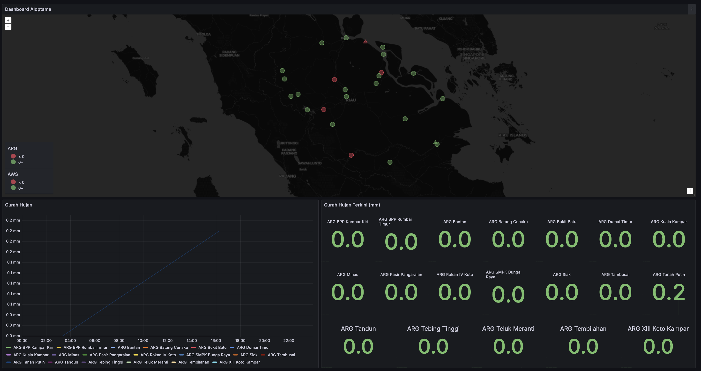
</p>
<p align="center"><i>Dashboard Aloptama</i></p>

***Fungsi Utama:***

<p align="justify">Aplikasi ini merupakan sistem monitoring untuk memantau kondisi operasional dan data observasi dari peralatan otomatis ALOPTAMA secara real-time. Aplikasi ini dirancang untuk berjalan di lingkungan lokal UPT menggunakan teknologi open-source, serta dapat dengan mudah dikembangkan atau direplikasi oleh unit kerja lainnya.</p>

***Dashboard ini menampilkan:***

- Data realtime dari sensor
- Visualisasi data cuaca (suhu, kelembapan, kecepatan & arah angin, tekanan udara & hujan)
- Peta & warning center status peralatan
- Presentase ketersediaan data harian (data availbility)
- Tegangan dan kondisi baterai

***Penjelasan Setiap Komponen Stack DPNG***

1. [Docker](https://www.docker.com/) – Platform Kontainerisasi.

<p align="justify">Docker digunakan untuk menjalankan seluruh aplikasi dalam bentuk kontainer (isolasi). Memudahkan instalasi, deployment, dan pemeliharaan aplikasi tanpa perlu memikirkan dukungan operating system (OS). Jika suatu kontainer dapat berjalan di suatu PC, maka kontainer yang sama dapat juga berjalan di PC lain yang menggunakan OS yang sama atau bahkan berbeda. </p>

<p align="justify">Seluruh layanan (Grafana, PostgreSQL, Node-RED, Mosquitto MQTT) dijalankan sebagai kontainer terpisah dalam satu virtual Machine (VM) Ubuntu. </p>

2. [MQTT](https://mqtt.org/) - Protokol komunikasi IoT

<p align="justify">MQTT adalah protokol komunikasi ringan dengan sistem publish/subscribe yang dirancang untuk perangkat dengan konektivitas terbatas atau bandwidth rendah — sangat ideal untuk sistem IoT seperti ARG dan AWS. </p>
3. [Node-RED](https://nodered.org/) – Sistem integrasi data

<p align="justify">Digunakan untuk mengatur aliran data dari perangkat AWS/ARG/AAWS yang menggunakan protokol MQTT agar dapat tersimpan ke dalam sistem database. Memungkinkan pemrosesan data (filter, format JSON, injeksi SQL) tanpa perlu coding kompleks. Antarmuka drag-and-drop memudahkan integrasi sensor, logger, atau MQTT ke PostgreSQL.
</p>

3. [PostgreSQL](https://www.postgresql.org/) (dengan ekstensi [TimescaleDB](https://github.com/timescale/timescaledb)) – Time-Series Database

<p align="justify">PostgreSQL dengan ekstensi pengembangan TimescaleDB, adalah database yang dioptimalkan untuk penyimpanan data time-series. Menyimpan data observasi cuaca seperti suhu, kelembapan, tekanan, dan curah hujan secara efisien dengan menggunakan key timestamp. 
Ekstensi TimescaleDB mendukung proses query yang cepat dan performa tinggi untuk jutaan baris data, dibandingkan dengan menggunakan database relational traditional[^1].</p>


4. [Grafana](https://grafana.com/) – Dashboard Visualisasi
   
<p align="justify">Digunakan untuk membuat panel visual yang menampilkan data time-series dari PostgreSQL dalam bentuk angka, grafik, tabel dan indikator. Dashboard dapat dikustomisasi untuk setiap parameter atau peralatan.</p>

***Manfaat Utama Aplikasi***

- Real-time: Monitoring langsung status alat dan data cuaca.
- Open-source: Tanpa lisensi komersial, fleksibel dan gratis.
- Portabel: Bisa dijalankan di laptop, server lokal, atau cloud.
- Visual & Dinamis: Data dapat diolah dan diproses secara cepat oleh operator dan analis.

## 5. Arsitektur Sistem

<p align="justify">Dashboard monitoring ALOPTAMA dikembangkan dengan arsitektur berbasis virtualisasi dan kontainerisasi, yang mendukung fleksibilitas, efisiensi sumber daya, serta kemudahan dalam deployment dan pemeliharaan.</p>

### Infrastruktur Fisik (Hardware)

<p align="justify">Seluruh sistem dijalankan di atas server HPE ProLiant Gen10, yang berfungsi sebagai hypervisor virtual utama menggunakan Proxmox Virtual Environment (VE). Spesifikasi utama server:

- Model: HPE ProLiant DL series Gen10
- Prosesor: Intel Xeon E5-2620 v4 @ 2.10GHz 16 core
- RAM: 616 GB ECC DDR4
- Storage: 2× HDD 300 GB RAID 1 untuk sistem redundant

<p align="center">
  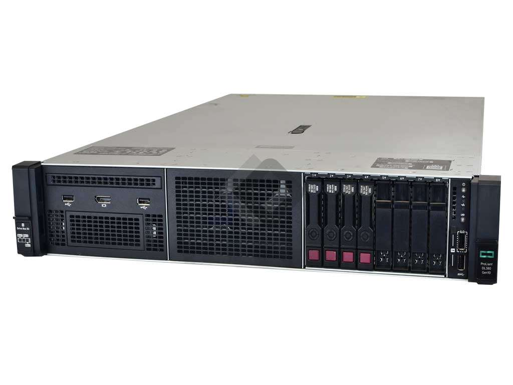
</p>
<p align="center"><em>HPE Proliant DL Gen 10 Server</em></p>

### Infrastruktur Virtual/non-fisik

<p align="justify">Hypervisor adalah perangkat lunak yang berjalan langsung di atas perangkat keras (bare metal) untuk membuat dan mengelola beberapa virtual machine (VM), masing-masing dengan sistem operasi sendiri. Sementara itu, Docker Engine berjalan di dalam sistem operasi (biasanya dalam VM atau host), dan digunakan untuk menjalankan aplikasi dalam kontainer yang ringan dan berbagi kernel dengan host, tanpa perlu sistem operasi terpisah seperti pada VM.</p>

<p align="center">
  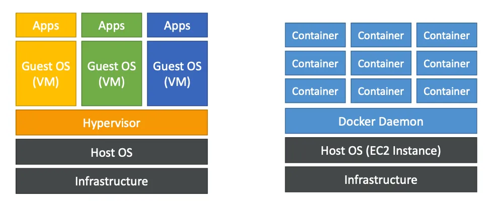
</p>
<p align="center"><em>Hypervisor (kiri) vs Docker Engine (kanan)</em></p>


***Virtualisasi (Hypervisor Layer)***

<p align="justify">Virtualisasi yang digunakan adalah [Proxmox VE](https://www.proxmox.com/en/), yang memungkinkan pengelolaan lebih dari satu  VM seperti Ubuntu Server berjalan bersama-sama dalam satu fisik bare metal. Sistem ini menyediakan isolasi penuh antar layanan, sekaligus mempermudah proses konfigurasi dan backup data.</p>

<p align="justify">VM yang berjalan sebagai host (rumah) untuk semua layanan/apps monitoring, dari Node-Red, Docker, PostgreSQL dan Grafana berjalan menggunakan operating system Ubuntu 24.04. Alokasi RAM sebesar 10GB dan 2 Core CPU dengan HDD 20GB. Alokasi resource ini bisa sewaktu-waktu diubah berdasarkan kebutuhan penggunaan. </p>

<p align="center">
  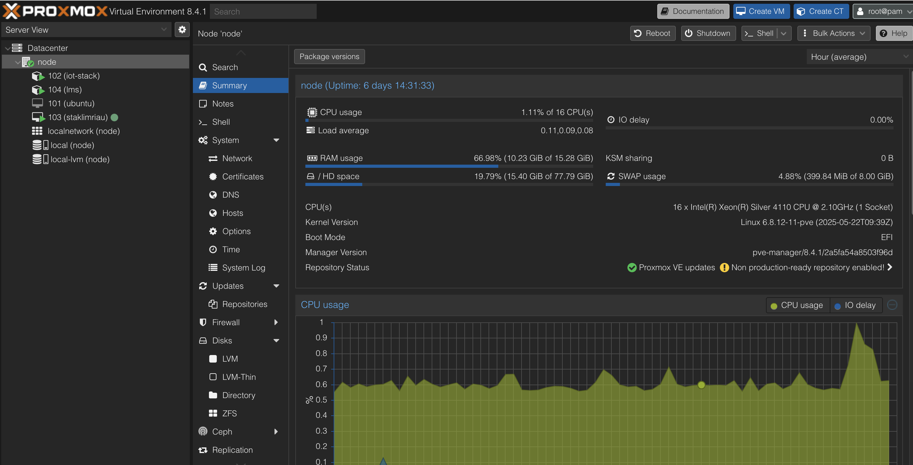
</p>
<p align="center"><em>Proxmox Interface</em></p>


***Kontainerisasi (Application Layer)***

<p align="justify">Di dalam VM Ubuntu tersebut, digunakan Docker dan Docker Compose untuk menjalankan seluruh komponen aplikasi dalam bentuk kontainer, dengan stack sebagai berikut:

- Node-RED: Bertugas mengelola aliran data dari perangkat ke database.
- PostgreSQL dengan TimescaleDB: Database berbasis time-series penyimpanan data pengamatan cuaca.
- Grafana: Visualisasi data dalam bentuk dashboard yang dapat dikustomisasi.

Selain stack diatas, penulis juga mendeploy aplikasi pendukung lain seperti :

- Portainer : Tampilan antarmuka berbasis web untuk mengelola kontainer Docker.
- PgAdmin : Tampilan antarmuka untuk mengelola database PostgreSQL
  
<p align="center">
  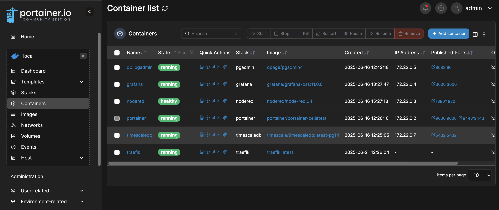
</p>
<p align="center"><em>Portainer dengan Docker container berjalan</em></p>


##### Flow data diagram

<p align="center">
  
</p>
<p align="center"><em>Data flow sequence diagram</em></p>

<p align="justify">Secara garis besar, Aloptama akan mengirimkan data via MQTT protokol ke server MQTT broker milik IRK. Docker yang memiliki container berjalan Node-Red, PostgreSQL dan Grafana akan bekerja secara paralel. Node-Red akan menjadi client MQTT akan  subscribe topik tertentu pada MQTT broker. Setiap payload pesan dalam bentuk JSON yang masuk akan diolah dan diinjeksi oleh Node-Red ke dalam sistem database PostgreSQL. Lalu Grafana akan membuat query dan membaca database dari PostgreSQL untuk mengupdate nilai metrik pada dashboard.</p>

#### Database Sistem

<table style="margin-left: auto; margin-right: auto; width: 100%;">
  <tr>
    <td style="text-align: center; vertical-align: top;">
      <p style="font-size: 14px; font-weight: bold;">Tabel AWS/AAWS</p>
      
    </td>
    <td style="text-align: center; vertical-align: top;">
      <p style="font-size: 14px; font-weight: bold;">Tabel ARG</p>
      
    </td>
  </tr>
</table>


<p align="justify">Setiap jenis peralatan memiliki tabel sendiri untuk menyimpan data, namun semua tabel memiliki elemen waktu (timestamp) sebagai primary key bersama dengan station ID. Timestamp menjadi primary key karena time-series database membutuhkan query berdasarkan waktu, sedangkan station_id  memberikan sebuah pengenal unik dari setiap lokasi peralatan. Terdapat 3 table yang digunakan dalam projek ini, yaitu table arg, aws, aaws. Struktur table aws dan aaws mempunyai column parameter yang sama, sedangkan arg memiliki parameter yang lebih sedikit. Struktur tabel dapat dilihat pada diagram berikut ini. </p>

### Infrastruktur Jaringan

<p align="justify">Selama proses pengembangan dan uji coba, dashboard dan aplikasi yang dideploy di Docker kontainer dapat diakses dengan menggunakan jaringan lokal di UPT Stasiun Klimatologi Riau, memanfaatkan jaringan revitalisasi LAN. </p>

<p align="center">
  
</p>
<p align="center"><em>Diagram Arsitektur Jaringan Lokal</em></p>

<p align="justify">Dengan menggunakan fitur Virtual Local Area Network (VLAN) pada Mikrotik, setiap sub-jaringan atau perangkat bisa dipisahkan sesuai kebutuhan. Beberapa keuntungan dengan membuat VLAN berbeda :</p>

- Meningkatkan keamanan: antar-VLAN tidak bisa saling mengakses tanpa izin (routing).
- Mempermudah manajemen: memisahkan jaringan berdasarkan fungsi/departemen (misal: VLAN 10 untuk local network, VLAN 20 hanya untuk Proxmox Management).
- Mengurangi kemungkinan alokasi IP address habis.


***Tabel IP Address, Gateway, dan VLAN***

| Perangkat / Komponen          | IP Address      | Gateway      | VLAN | Keterangan                                |
| ----------------------------- | --------------- | ------------ | ---- | ----------------------------------------- |
| **Internet/ISP**              | x.x.x.x               | -            | -    | Sumber koneksi internet                   |
| **Modem**                     | x.x.x.x               | -            | -    | Perangkat penghubung ke ISP               |
| **MikroTik Router**           | 192.168.10.1/24 | -            | -    | Router utama, gateway jaringan lokal      |
| **Local Network/WiFi**        | 192.168.10.0/24 | 192.168.10.1 | -    | Jaringan WiFi/LAN lokal, subnet default   |
| **HPE Server (Proxmox Host)** | 192.168.20.0/24 | 192.168.20.1 | 20   | Host Proxmox, trunk VLAN 20 dari MikroTik |
| **Virtual Machine** | 192.168.30.0/24 | 192.168.30.1 | 30   | Trunk VLAN 30 |

***VM di Dalam Proxmox***

| Virtual Machine | IP Address       | Gateway      | VLAN | Keterangan                                |
| --------------- | ---------------- | ------------ | ---- | ----------------------------------------- |
| **VM Ubuntu**   | 192.168.30.20/24 | 192.168.30.1 | 30   | VM utama, menjalankan layanan Docker      |
| **VM Lain**     | 192.168.30.10/24  | 192.168.30.1 | 30   | VM tambahan dalam subnet & VLAN yang sama |
| **LXC Container**     | 192.168.30.2/24  | 192.168.30.1 | 30   | LXC Container untuk aplikasi lain |

***Docker Container di VM Ubuntu***

| Docker Container | IP Address (Docker Network) | Port Aplikasi | Keterangan                
| ---------------- | --------------------------- | ------------------ | ---- | 
| **Grafana**      | 172.22.0.4/16               |3000    | Monitoring dashboard      |
| **PostgreSQL**   | 	172.22.0.7/16               |8083    | Database backend          |
| **Node-RED**     | 172.22.0.3/16               | 1880    | Otomatisasi alur data IoT |
| **Portainer**     | 172.22.0.2/16               |9443    | GUI untuk Docker |


## 6. Hasil Implementasi di Lapangan

- **Aplikasi diuji coba di UPT**: Stasiun Klimatologi Riau
- **Data yang berhasil ditampilkan**: Semua parameter
- **Aplikasi berjalan stabil selama uji coba ±3 hari**

<p align="center">
  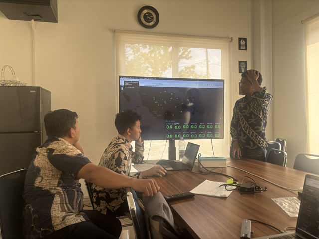
</p>
<p align="center"><em>Presentasi Uji coba di UPT</em></p>


<style>
.center-table {
  margin-left: auto;
  margin-right: auto;
}
</style>

<table class="center-table">
  <tr>
    <!-- Image 2 -->
    <td>
      <p align="center" style="font-size: 14px; font-weight: bold;">Curah Hujan</p>
      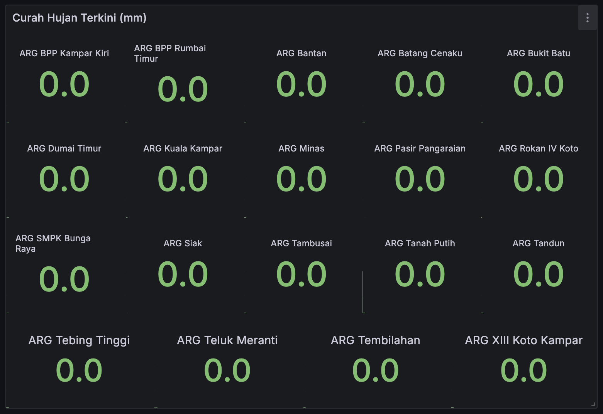
      <br>
    </td>
    <td>
      <p align="center" style="font-size: 14px; font-weight: bold;">Presentase Data Harian</p>
      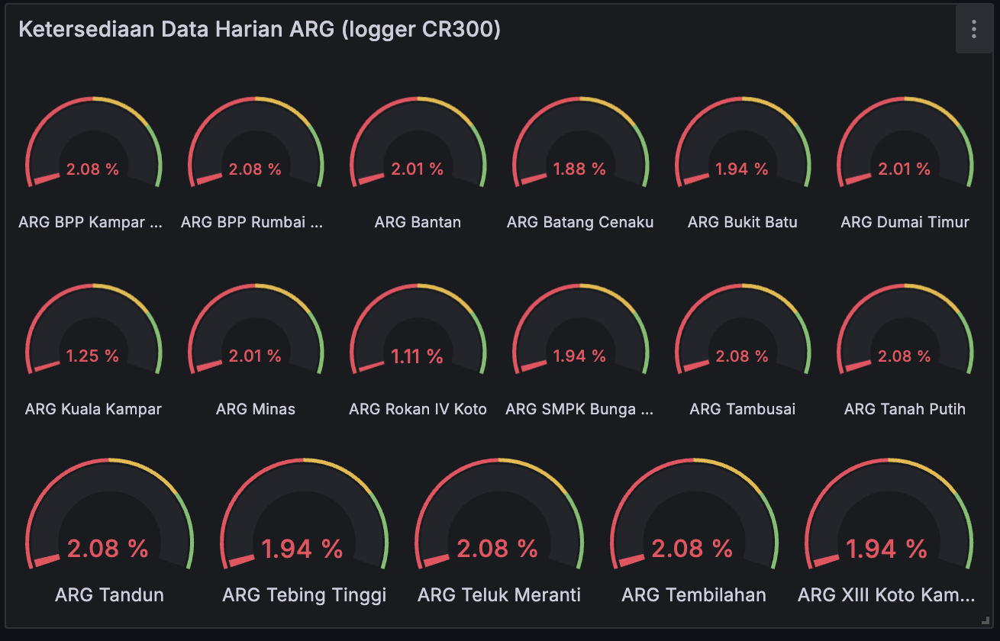
      <br>
    </td>
  </tr>
</table>

<table class="center-table">
  <tr>
    <!-- Image 4 -->
    <td>
      <p align="center" style="font-size: 14px; font-weight: bold;">Tegangan Baterai</p>
      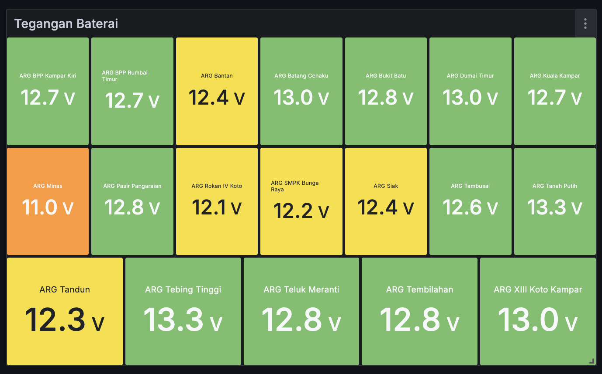
      <br>
    </td>
    <td>
      <p align="center" style="font-size: 14px; font-weight: bold;">Tegangan Baterai</p>
      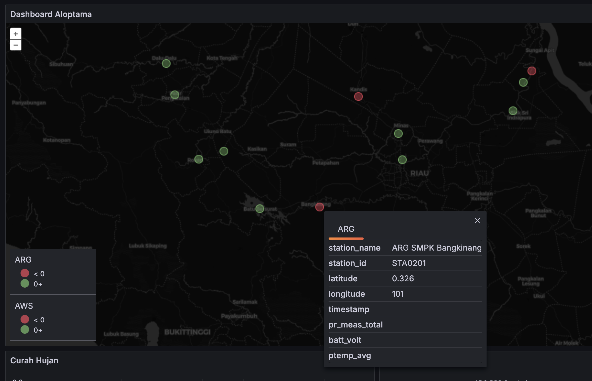
      <br>
    </td>
  </tr>
</table>

***Masukan dari rekan kerja/operator:***

> "Aplikasi ini sangat membantu karena kami bisa langsung pantau data dari kantor dengan jaringan lokal." Anonymous

> "Kedepannya dashboard ini bisa dikembangkan lagi dengan memasukan metadata kapan terakhir kali kunjungan pemeliharaan dan kalibrasi." Pak Joko - Plt. Kepala

> "Dashboard dipublish ke internet dan dapat diakses dengan menggunakan domain." Rekan Teknisi

## 7. Tantangan dan Solusi

| Tantangan                                        | Solusi                                                 |
| ------------------------------------------------ | ------------------------------------------------------ |
| Dashboard baru bisa diakses pada jaringan lokal | Port Forwarding (kurang aman) / Menggunakan VPN Peer to Peer (lebih aman)                   |
| Belum ada AC bekerja 24 Jam di ruang server         | Penambahan anggaran LTGA / Revisi anggaran |
| Untuk mengakses dashboard Grafana masih menggunakan IP address lokal             | Menggunakan DNS / Membeli Domain Name    |
| Belum ada dedicated UPS khusus untuk PC Server             | Penganggaran UPS min 2KVA untuk tahun depan    |

## 8. Dampak dan Manfaat

Manfaat yang diharapkan dari pengembangan dashboard monitoring Aloptama di UPT Stasiun Klimatologi Riau ini adalah :

- Akses data lebih cepat sehingga pelayanan MK lebih terjamin
- Meningkatkan ketanggapan dan kesiapsiagaan para teknisi dalam proses PM/CM Aloptama
- Memberikan alert warning bagi pengguna jika terjadi hujan ekstrim
- Memberikan justifikasi kehandalan Aloptama sebagai sumber data selain Pos Hujan dalam pembuatan peta HTH

## 9. Rencana Tindak Lanjut

<p align="justify">Dalam pengembangan selanjutnya, penulis mempunyai rencana sebagai berikut :</p>

- Menggunakan nama domain alih-alih dengan IP address untuk mengakses dashboard, e.g : dashboard.staklimriau.web.id
- Mempublish dashboard ke Internet sehingga bisa diaksed dari mana saja dan kapan saja dengan menggunakan sebuah login
- Menambahkan tabel baru pada database untuk menyimpan informasi waktu pemeliharaan dan kalibrasi.
- Menambahkan aplikasi lain ke dalam Docker yang berguna bagi pegawai untuk mendukung WFH.

## 10. Penutup (Kesimpulan)

<p align="justify">Implementasi aplikasi MQTT ini membuktikan bahwa sistem pemantauan Aloptama dapat dibuat oleh setiap UPT dengan memanfaatkan resource yang ada dan menggunakan aplikasi open-source yang gratis.</p>

<p align="justify">Terima kasih kepada fasilitator PPSDM BMKG, tim coaching Stasiun Klimatologi Banten, tim penguji serta rekan rekan di Stasiun Klimatologi Riau. Ilmu dan praktik yang diperoleh sangat bermanfaat dan langsung dapat diterapkan di unit kerja kami.</p>

---

## Lampiran

### Dokumentasi Kegiatan  

***Tangkapan layar flow NodeRed***

<p align="center">
  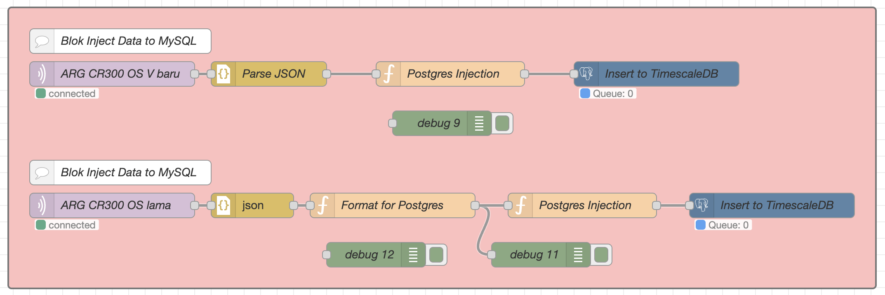
</p>
<p align="center"><em>Node Injeksi data ke PostgreSQL pada NodeRed</em></p>


***Tangkapan layar blok notifikasi Telegram***

<p align="center">
  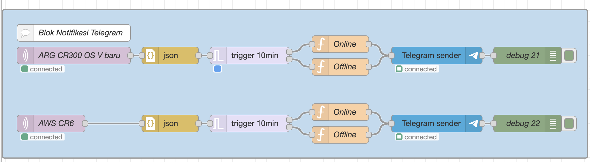
</p>
<p align="center"><em>Blok notifikasi Telegram di NodeRed</em></p>

***Contoh query data curah hujan PostgreSQL***

```sql
SELECT
  timestamp AS time,
  station_name AS metric,
  pr_meas_total
FROM arg
WHERE
  $__timeFilter(timestamp)
  AND station_name IS NOT NULL
ORDER BY timestamp;
```

***Contoh dashboard Grafana untuk menampilkan data curah hujan***

```json
{
  "datasource": {
    "uid": "aep4vv5e0bpxca",
    "type": "grafana-postgresql-datasource"
  },
  "fieldConfig": {
    "defaults": {
      "mappings": [],
      "thresholds": {
        "mode": "absolute",
        "steps": [
          {
            "color": "green",
            "value": null
          },
          {
            "color": "yellow",
            "value": 50
          },
          {
            "color": "orange",
            "value": 100
          },
          {
            "color": "red",
            "value": 150
          }
        ]
      },
      "color": {
        "mode": "thresholds"
      },
      "decimals": 1
    },
    "overrides": []
  },
  "gridPos": {
    "h": 14,
    "w": 13,
    "x": 11,
    "y": 16
  },
  "id": 5,
  "options": {
    "reduceOptions": {
      "values": false,
      "calcs": [
        "lastNotNull"
      ],
      "fields": ""
    },
    "orientation": "auto",
    "textMode": "auto",
    "wideLayout": true,
    "colorMode": "value",
    "graphMode": "area",
    "justifyMode": "center",
    "showPercentChange": false
  },
  "pluginVersion": "11.0.0",
  "targets": [
    {
      "datasource": {
        "type": "grafana-postgresql-datasource",
        "uid": "aep4vv5e0bpxca"
      },
      "editorMode": "code",
      "format": "time_series",
      "rawQuery": true,
      "rawSql": "SELECT\n  timestamp AS time,\n  station_name AS metric,\n  pr_meas_total\nFROM arg\nWHERE\n  $__timeFilter(timestamp)\n  AND station_name IS NOT NULL\nORDER BY timestamp;\n",
      "refId": "A",
      "sql": {
        "columns": [
          {
            "parameters": [],
            "type": "function"
          }
        ],
        "groupBy": [
          {
            "property": {
              "type": "string"
            },
            "type": "groupBy"
          }
        ],
        "limit": 50
      }
    }
  ],
  "title": "Curah Hujan ARG (mm)",
  "type": "stat"
}
```

***Dokumentasi script Docker, laporan dan cara penggunaan stack dashboard ini ada di repository penulis***

```git
https://github.com/satria-mitra/homelab-staklimriau

```

[^1]: https://www.tigerdata.com/blog/time-series-data-why-and-how-to-use-a-relational-database-instead-of-nosql-d0cd6975e87c
